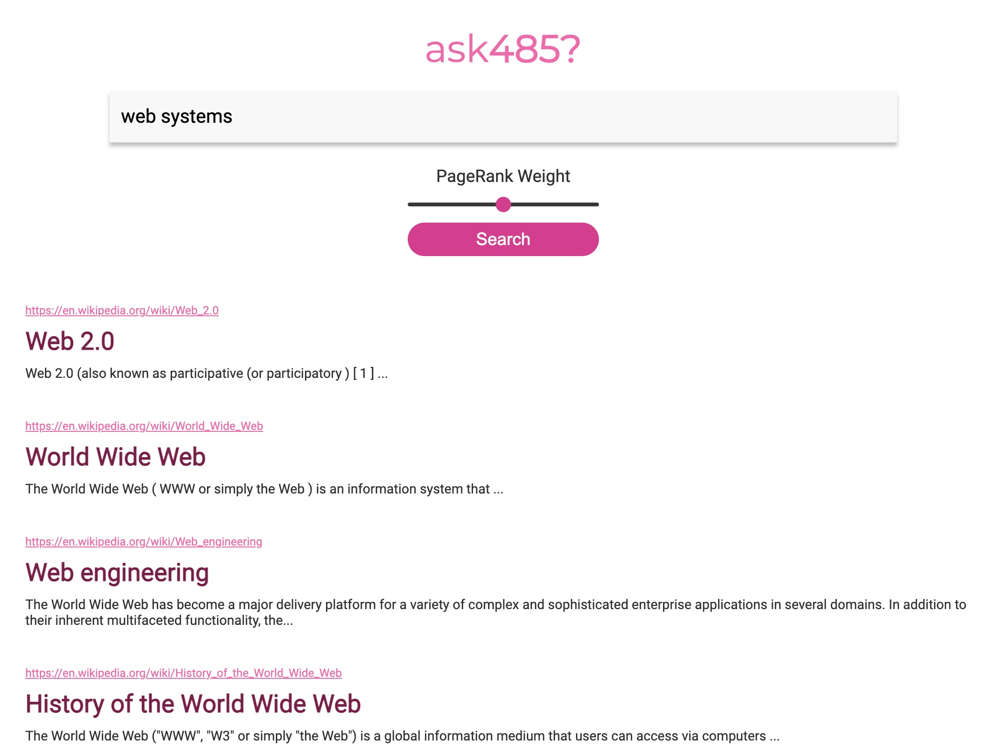

# Search Engine

- Built a scalable search engine similar to Google or Bing.
- Includes information retrieval concepts like text analysis (tf-idf) and link analysis (PageRank), and parallel data processing with MapReduce.
- Uses a Service-Oriented Architecture to scale dynamic pages and web search.
- Creates a segmented inverted index of web pages using a pipeline of MapReduce programs.
- Built an Index server, a REST API app that returns search results in JSON format.
- Built a Search server, a user interface that returns search results just like Google or Bing.

---

## Usage Instructions 

### [Demo](http://7ewfwy-ip-50-217-59-154.tunnelmole.net/)

- Use the link above to access the search engine.
- The Search server is a user interface implemented with server-side dynamic pages. A user enters a query and the Search server returns a page of search results.
- The Search server backend makes REST API requests to each Index server and combines the results from each inverted index segment. It makes these requests in parallel threads.
- The Search server then displays the top 10 results to the client.
- To test it type in various queries into and adjust the weights by using the slider to see the variations in results.

---

Technologies: Python, SQL, Flask, HTML and CSS, JSON
